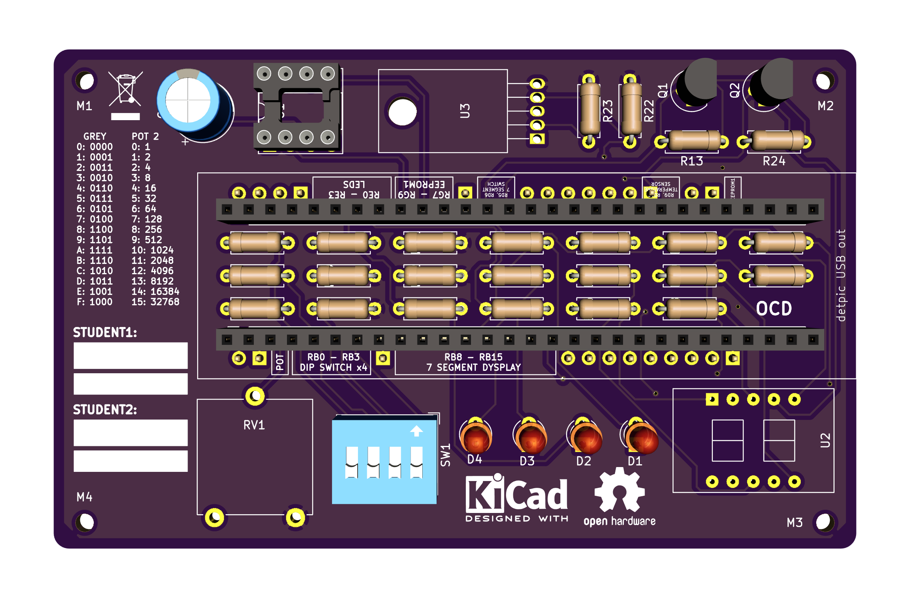

This repository contains hardware designs for a PCB shield that extends the detpic32 develpoment board created at DETI UA

## Description

This project provides a solution to the transportation and handle of the circuitry needed to extend the detpic development board functionalities for the subject of Computer Arquitectures II at Deti UA.

The most frequent situation that the students enroled in the subject experience is the circuitry assembly in low quality bread boards, usally poorly mounted and disorganised. The transportation inside the backpacks usally causes faulty connections, sometimes hard to debug.

The shield provides a robust solution, easy to transport, user friendly and fault proof.

> __The existence of this pcb doesn't implies that the students shouldn't prototype the circuitry in the bread board at least once. It is important that the student understands the schematic and be able to assembly the circuit autonomously.__

## Customize

Most likely you will have to change the PCB, since you might not have some of the components or you have to add a few more. We can't (shouldn't) do it for you, so you have to learn how to work with [Kicad](http://kicad-pcb.org/). Kicad is an open-source PCB designer with builds for every platform. You can read the documentation and there are plenty of tutorials on Youtube.

This is an open source project, so feel free to change the board to your preferences, e.g. add more LEDs, put your name in the PCB, change the components to your needs, etc.

Every PCB in this repo has a README that can be found in the root directory of the respective project folder. This document has usefull information that should be read if you plan to modify it.

## Order

The sugested PCB prototype manufacturer is [JLCPCB](https://jlcpcb.com/). It is cheap, less that 10€ for 5 PCBs (< 100x100mm), and you can order it with other students. We have used it before and the quality is ok. Feel free to DIY.

To order you just need to upload the gerber files and follow the instructions in the respective manufacturer website. The gerber files can be found in the gerber folder inside the board project directory.

## Boards

| Name  | Descripion |
| ------------- | ------------- |
| [__20182019-TH-V1.0__](https://github.com/dvcorreia/ac2-detpic-shield/tree/master/hardware)  |  1st version of the throught hole 2019's board

## Issues

Any issue or question can be reported here on Github on the [issues](https://github.com/dvcorreia/ac2-detpic-shield/issues) tab. Remember to describe the problem clearly, write the process so we can emulate the problem. Printscreens might be usefull to.
We will try to anwser you as fast as possible.

## Contributing

Feel free to contribute your version of the PCB! Others might enjoy it and would like to use it.

To do so, open a [pull request](https://help.github.com/en/articles/about-pull-requests). Make sure to follow the organization structure
already implemented. Don't forget to add a README with usefull information. Check the one in _20182019-TH-V1.0_ project directory has an example.
