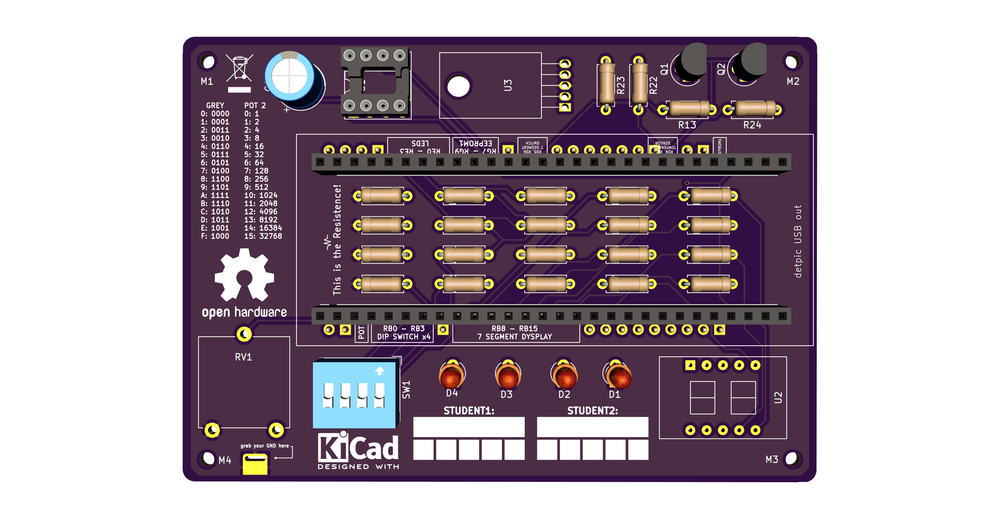

# 20182019-TH-V1.0

    Name: 20182019-TH-V1.1
    Year: 2018/2019
    Size: 99.06mm x 69.6mm
    Author: Diogo Correia (@dvcorreia)

## Render

Make sure that your components footprints are the ones been used in this PCB. If not be sure to change them.
There is a __test-fit.pdf__ inside the /docs folder that you can print to check if your components fit.

## Description

- This board implements the default circuitry of the 2018/2019 subject guide
- All of its components are throught hole
- The routes were computed using [Freerouting](https://freerouting.org/freerouting/using-with-kicad)

## Sugestions

- Replace some throught hole components with SMD
- Use resistor arrays

## Pins

- :white_check_mark:: not being used 

- :red_circle:: being used

| N  | CN1  | Description          | CN2  | Description   |
|----|------|----------------------|------|---------------|
| 1  | RE7  | -                    | RB6  | -             |
| 2  | RE6  | -                    | RB5  | -             |
| 3  | RE5  | -                    | RB4  | Potentiometer |
| 4  | RE4  | -                    | RB3  | DIP Switch x4 |
| 5  | RE3  | LEDS                 | RB2  | DIP Switch x4 |
| 6  | RE2  | LEDS                 | RB1  | DIP Switch x4 |
| 7  | RE1  | LEDS                 | RB0  | DIP Switch x4 |
| 8  | RE0  | LEDS                 | RB7  | -             |
| 9  | RG7  | EEPROM 1             | RB8  | 7 SEG Display |
| 10 | RG8  | EEPROM 1             | RB9  | 7 SEG Display |
| 11 | RG9  | EEPROM 1             | RB10 | 7 SEG Display |
| 12 | RD7  | -                    | RB11 | 7 SEG Display |
| 13 | RD6  | 7 SEG Display Switch | RB12 | 7 SEG Display |
| 14 | RD5  | 7 SEG Display Switch | RB13 | 7 SEG Display |
| 15 | RD4  | -                    | RB14 | 7 SEG Display |
| 16 | RD3  | -                    | RB15 | 7 SEG Display |
| 17 | RD2  | -                    | RF0  | -             |
| 18 | RD1  | -                    | RF1  | -             |
| 19 | RD0  | -                    | RF3  | -             |
| 20 | RD11 | -                    | RF4  | -             |
| 21 | RD10 | Temperature Sensor   | RF5  | -             |
| 22 | RD9  | Temperature Sensor   | VBUS | -             |
| 23 | RD8  | -                    | VUSB | -             |
| 24 | RG3  | -                    | RG2  | -             |
| 25 | RG6  | EEPROM 1             | RC13 | -             |

